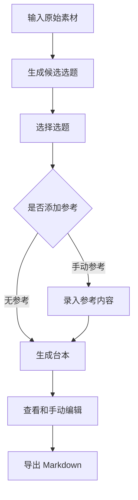
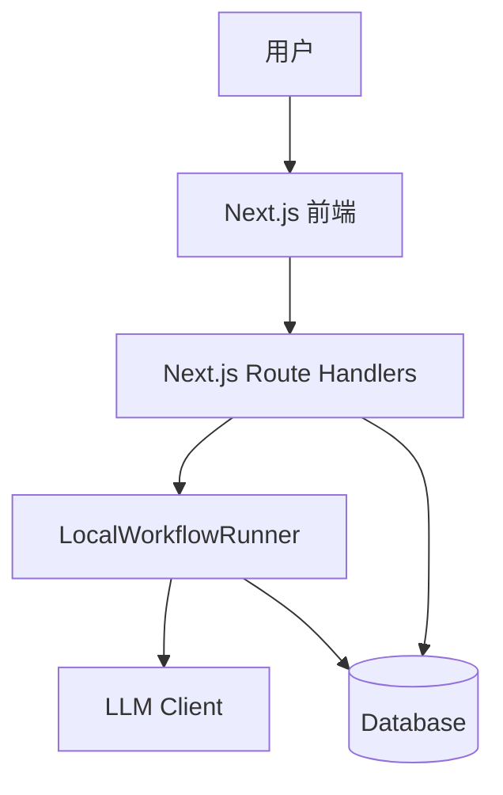
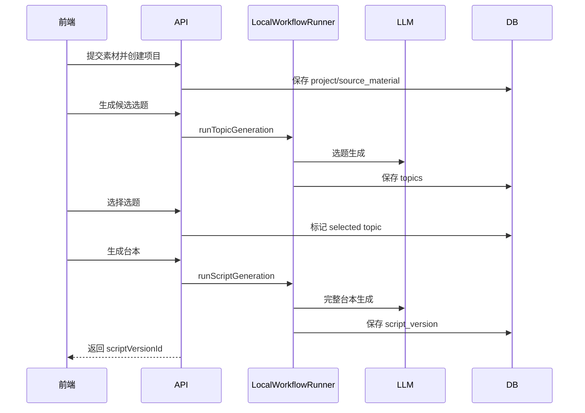

# AI 自媒体视频台本生成系统设计文档 V5（核心落地版）

## 1. 文档定位

V5 是一份面向落地验证的简化设计文档。

它不追求一次性设计完整的创作平台，而是先验证最核心的产品价值：

```text
原始素材 -> 候选选题 -> 选中选题 -> 可剪辑台本 -> Markdown 导出
```

第一版只要能稳定生成一条 60 秒左右的口播视频台本，就算核心闭环成立。

## 2. 核心原则

- 优先跑通主链路，不提前建设复杂平台能力。
- 优先手动输入和可控流程，不依赖搜索、爬虫、平台接口。
- 优先保存最终可用结果，不追求完整协作、审批、版本治理。
- Agent 拆分服务于产出质量，不为拆分而拆分。
- 第一版允许同步执行工作流，后续再替换为队列。

## 3. 阶段零范围

### 3.1 必做

- 单用户本地模式。
- 创建项目。
- 输入原始素材：聊天记录、灵感、笔记、已有文案。
- 生成 3-5 个候选选题。
- 用户选择一个目标选题。
- 参考内容可选：
  - `none`：无参考，直接生成。
  - `manual`：用户手动粘贴参考文案或字幕。
- 生成完整台本。
- 展示并允许手动编辑台本。
- 导出 Markdown。
- 保存项目、素材、选题、参考、最终台本，支持再次打开查看。

### 3.2 不做

- 用户注册、登录、多用户权限。
- 通用 Web 搜索。
- 平台 API。
- 自建爬虫。
- Redis / BullMQ 队列。
- SSE 实时进度。
- 单段 AI 重写。
- 复杂版本管理。
- JSON / CSV 导出。
- 自动剪辑、自动发布。
- AI 生图、生视频。

## 4. 产品流程



关键点：

- 参考内容不是必经步骤。
- 没有参考时，系统根据原始素材和选题直接生成台本。
- 手动参考只作为结构和表达方向参考，不要求生成完整知识库。

## 5. 简化架构



阶段零只需要：

- Next.js App Router。
- Route Handlers 提供 API。
- Prisma 管理数据库。
- 本地同步 `LocalWorkflowRunner`。
- LLM Client 封装模型调用。

运行边界：

- 阶段零只承诺本地 Node.js runtime 运行，不承诺 serverless 部署。
- 生成选题和生成台本都可以在 HTTP 请求内同步完成。
- API 层设置明确超时，例如选题 60 秒、台本 180 秒。
- 超时或失败时直接返回错误，前端保留输入内容，用户点击重试。
- 生成过程中前端只需要按钮 loading 状态，不做 SSE 进度。

数据库建议：

- 本地验证可用 SQLite。
- 如果后续确定要部署，切 PostgreSQL。
- 数据模型保持 Prisma 兼容，避免迁移成本过高。

## 6. 页面设计

阶段零只需要 4 个页面。

| 页面 | 作用 |
|---|---|
| `/projects` | 项目列表 |
| `/projects/new` | 创建项目并输入素材 |
| `/projects/:id/workbench` | 选题、参考、生成台本 |
| `/projects/:id/script` | 查看、编辑、导出台本 |

工作台可以先做成单页步骤流：

1. 素材区。
2. 候选选题区。
3. 可选参考区。
4. 生成按钮。
5. 生成结果入口。

## 7. Agent 设计

V5 不要求每个 Agent 都对应独立 Worker 或复杂编排。可以先用一个本地 runner 顺序调用多个生成步骤。

### 7.1 选题 Agent

输入：

- 原始素材。
- 目标平台。
- 视频类型。
- 目标时长。

输出：

```json
{
  "themeSummary": "关于拖延本质的重新解释",
  "candidates": [
    {
      "title": "你不是拖延，你是在逃避一个太模糊的目标",
      "targetAudience": "25-35岁职场人",
      "coreConflict": "拖延 vs 目标模糊带来的恐惧",
      "emotionalTone": "刺痛后释然",
      "score": 0.91,
      "reason": "具备反常识、代入感和方法价值"
    }
  ]
}
```

### 7.2 台本生成 Agent

V5 将视频框架、钩子、台词、情绪、画面、BGM 合并到一个台本生成 Agent 中。

这样做的原因：

- 阶段零最重要的是产出完整台本，不是验证多 Agent 基础设施。
- 一次生成更容易保持风格一致。
- 后续如果质量不够，再拆出独立 Agent。

输入：

- 项目信息。
- 原始素材。
- 选中选题。
- 可选手动参考。
- 目标时长。

输出：

```json
{
  "title": "你不是拖延，你是在逃避一个太模糊的目标",
  "durationSeconds": 60,
  "summary": "通过重新解释拖延，引导观众从自责转向行动",
  "segments": [
    {
      "orderIndex": 1,
      "startTime": 0,
      "endTime": 5,
      "segmentGoal": "制造认知冲突",
      "dialogue": "你以为你是在拖延，其实你是在害怕开始。",
      "subtitleText": "你不是拖延，是害怕开始",
      "hook": {
        "type": "反常识钩子",
        "intent": "打破观众对拖延的常规理解"
      },
      "emotion": {
        "primary": "刺痛",
        "intensity": 8
      },
      "visual": {
        "description": "空白文档和停滞的手",
        "imagePrompt": "young professional sitting in front of a blank document on laptop, dim room, cinematic lighting, vertical 9:16"
      },
      "bgm": {
        "mood": "低频悬疑",
        "keywords": ["ambient tension"]
      },
      "directorNote": "开头停顿 0.8 秒，关键词字幕加粗"
    }
  ]
}
```

### 7.3 简单质量校验

阶段零只做必要校验：

- 返回 JSON 能通过 schema。
- 至少有 3 个段落。
- 第一段从 0 秒开始。
- 段落时间不重叠。
- 最后一段结束时间接近目标时长。
- 每段有台词、字幕、画面提示和导演备注。
- 每段 `endTime` 必须大于 `startTime`。
- 每段台词不能为空。
- 口播字数需要和目标时长大致匹配，中文可按每秒 4-6 字估算。
- 总时长允许与目标时长有 10% 以内偏差。

不要求每段都有钩子，也不要求每段都有独立 BGM。

校验失败处理：

- JSON 结构错误：进入一次 repair retry。
- 时间轴或必填字段错误：进入一次 repair retry。
- 字数明显过短或过长：进入一次 repair retry，并把目标字数范围写入修复提示。
- repair 后仍失败：返回错误，不创建 `script_versions`。

## 8. 核心数据模型

阶段零只保留必要表。

### projects

| 字段 | 类型 | 说明 |
|---|---|---|
| id | string | 项目 ID |
| title | string | 项目标题 |
| status | string | draft / topic_ready / script_ready / exported |
| selected_topic_id | string nullable | 当前选中的选题 |
| target_platform | string | douyin / xiaohongshu / bilibili / video_account |
| video_type | string | oral / story / knowledge / opinion |
| duration_seconds | int | 目标时长 |
| created_at | datetime | 创建时间 |
| updated_at | datetime | 更新时间 |

### source_materials

| 字段 | 类型 | 说明 |
|---|---|---|
| id | string | 素材 ID |
| project_id | string | 项目 ID |
| content | text | 原始素材 |
| created_at | datetime | 创建时间 |

阶段零可以明文存储本地数据，不在这一版引入加密设计。

### topics

| 字段 | 类型 | 说明 |
|---|---|---|
| id | string | 选题 ID |
| project_id | string | 项目 ID |
| title | string | 选题标题 |
| target_audience | text | 目标受众 |
| core_conflict | text | 核心冲突 |
| emotional_tone | string | 情绪基调 |
| score | float | 推荐分 |
| reason | text | 推荐理由 |
| created_at | datetime | 创建时间 |

说明：

- 阶段零以 `projects.selected_topic_id` 作为唯一选中来源。
- 选择新选题时只更新 `projects.selected_topic_id`，不需要维护多个 topic 的 selected 状态。

### references

| 字段 | 类型 | 说明 |
|---|---|---|
| id | string | 参考 ID |
| project_id | string | 项目 ID |
| topic_id | string | 选题 ID |
| title | string | 参考标题 |
| url | string nullable | 链接 |
| transcript | text | 用户粘贴的参考文案 |
| created_at | datetime | 创建时间 |

### script_versions

| 字段 | 类型 | 说明 |
|---|---|---|
| id | string | 台本版本 ID |
| project_id | string | 项目 ID |
| topic_id | string | 选题 ID |
| title | string | 台本标题 |
| summary | text | 台本摘要 |
| duration_seconds | int | 实际时长 |
| content | json | 完整结构化台本 |
| created_at | datetime | 创建时间 |
| updated_at | datetime | 更新时间 |

说明：

- 阶段零不拆 `script_segments` 和 `segment_tracks`。
- 完整台本先整体存为 JSON。
- `content` 是唯一数据源。
- 前端编辑后只更新 `content`。
- Markdown 每次导出时由服务端根据 `content` 现渲染，不入库保存。
- 后续需要精细编辑和单段重写时，再拆分段落表。

## 9. API 设计

### 项目

```text
POST /api/projects
GET  /api/projects
GET  /api/projects/:projectId
```

创建项目请求：

```json
{
  "title": "关于拖延症的短视频",
  "targetPlatform": "douyin",
  "videoType": "oral",
  "durationSeconds": 60,
  "sourceMaterial": {
    "content": "这里粘贴聊天记录、灵感、笔记或已有文案"
  }
}
```

创建项目响应：

```json
{
  "projectId": "project_xxx",
  "status": "draft"
}
```

阶段零约定：

- 一个项目先只保存一份主素材。
- 如果需要修改素材，先通过前端编辑后重新保存项目；不单独设计素材版本。
- `durationSeconds` 默认 60，允许范围 15-180。
- `sourceMaterial.content` 必填，去除首尾空白后不能为空。

### 选题

```text
POST /api/projects/:projectId/topics/generate
GET  /api/projects/:projectId/topics
POST /api/projects/:projectId/topics/:topicId/select
```

生成选题请求：

```json
{
  "count": 5
}
```

生成选题响应：

```json
{
  "topics": [
    {
      "id": "topic_xxx",
      "title": "你不是拖延，你是在逃避一个太模糊的目标",
      "targetAudience": "25-35岁职场人",
      "coreConflict": "拖延 vs 目标模糊带来的恐惧",
      "emotionalTone": "刺痛后释然",
      "score": 0.91,
      "reason": "具备反常识、代入感和方法价值"
    }
  ]
}
```

选择选题响应：

```json
{
  "projectId": "project_xxx",
  "selectedTopicId": "topic_xxx",
  "status": "topic_ready"
}
```

规则：

- 生成选题会覆盖当前项目下尚未被选中的旧候选选题。
- 选择选题只更新 `projects.selected_topic_id` 和 `projects.status = "topic_ready"`。
- 生成台本时优先使用请求里的 `topicId`；如果未传，则使用 `projects.selected_topic_id`。
- 阶段零用 `topic_ready` 同时表示“已有候选选题”和“已选择选题”；是否已选择以 `selected_topic_id` 是否为空为准。

### 参考

```text
POST /api/projects/:projectId/references/manual
GET  /api/projects/:projectId/references
```

参考是可选能力。没有参考时，台本生成接口直接使用空参考。

手动参考请求：

```json
{
  "topicId": "topic_xxx",
  "items": [
    {
      "title": "参考视频标题，可为空",
      "url": "https://example.com",
      "transcript": "用户粘贴的参考文案或字幕"
    }
  ]
}
```

手动参考响应：

```json
{
  "referenceIds": ["ref_xxx"]
}
```

规则：

- `transcript` 必填。
- `title` 可为空，为空时用“手动参考 1”之类的默认标题。
- `topicId` 可不传；不传时使用 `projects.selected_topic_id`。
- 如果既未传 `topicId`，项目也没有 `selected_topic_id`，返回 `400 TOPIC_REQUIRED`。
- 阶段零不对参考内容做单独分析，只在生成台本时把参考文本作为上下文传给台本生成 Agent。

### 台本

```text
POST  /api/projects/:projectId/scripts/generate
GET   /api/projects/:projectId/scripts/latest
PATCH /api/projects/:projectId/scripts/:scriptVersionId
GET   /api/projects/:projectId/scripts/:scriptVersionId/export.md
```

生成台本请求：

```json
{
  "topicId": "topic_xxx",
  "referenceMode": "none",
  "durationSeconds": 60,
  "style": "sharp_emotional_oral"
}
```

如果使用手动参考：

```json
{
  "topicId": "topic_xxx",
  "referenceMode": "manual",
  "referenceIds": ["ref_xxx"],
  "durationSeconds": 60,
  "style": "sharp_emotional_oral"
}
```

生成台本响应：

```json
{
  "scriptVersionId": "script_xxx",
  "status": "script_ready"
}
```

编辑台本请求：

```json
{
  "content": {
    "title": "你不是拖延，你是在逃避一个太模糊的目标",
    "durationSeconds": 60,
    "segments": [
      {
        "orderIndex": 1,
        "startTime": 0,
        "endTime": 5,
        "dialogue": "你以为你是在拖延，其实你是在害怕开始。",
        "subtitleText": "你不是拖延，是害怕开始",
        "visual": {
          "description": "空白文档和停滞的手"
        },
        "directorNote": "开头停顿 0.8 秒"
      }
    ]
  }
}
```

规则：

- `referenceMode = "none"` 时忽略 `referenceIds`。
- `referenceMode = "manual"` 时，如果未传 `referenceIds`，默认读取当前选题下全部手动参考。
- 如果请求和项目都没有可用选题，返回 `400 TOPIC_REQUIRED`。
- `PATCH` 提交的 `content` 必须通过同一套台本 schema 和简单质量校验。
- `PATCH` 只更新 `script_versions.content`，并重新计算 `title/summary/duration_seconds` 等冗余字段。
- `export.md` 只读取 `content` 并即时渲染 Markdown。

## 10. 工作流

阶段零使用同步工作流。



错误处理保持简单：

- LLM 失败：返回错误，允许用户重试。
- JSON 解析失败：做一次 repair retry。
- repair 仍失败：保存失败原因，不保存台本。
- 用户刷新页面：从数据库读取项目状态和最新台本。

状态更新：

- 创建项目后：`projects.status = "draft"`。
- 生成选题成功后：`projects.status = "topic_ready"`。
- 选择选题后：写入 `projects.selected_topic_id`。
- 生成台本成功后：`projects.status = "script_ready"`。
- 导出 Markdown 后：`projects.status = "exported"`。

同步执行约定：

- `runTopicGeneration` 和 `runScriptGeneration` 都在 API 请求内执行。
- 前端提交后禁用按钮并显示 loading。
- 同一个项目同一时间不支持并发生成；前端阻止重复点击即可，后端可用简单状态判断兜底。
- 阶段零不需要持久化 workflow run，失败信息可以返回给前端并写入普通日志。

## 11. Markdown 导出

Markdown 是阶段零唯一导出格式。

建议格式：

```markdown
# 台本标题

## 基本信息

- 时长：60 秒
- 平台：抖音
- 类型：口播

## 分段台本

| 时间 | 台词 | 字幕 | 画面 | 情绪 | BGM | 导演备注 |
|---|---|---|---|---|---|---|
| 0-5s | ... | ... | ... | ... | ... | ... |

## 图片/视频提示词

1. ...

## 剪辑备注

- ...
```

导出过程不调用 LLM，只把 `script_versions.content` 渲染成 Markdown。

导出不写入第二份正文。需要展示导出结果时，直接返回 `text/markdown`。

## 12. 模型调用

阶段零只需要两个调用配置。

| 用途 | 模型 | 温度 | 输出 |
|---|---|---:|---|
| 选题生成 | fast model | 0.5 | JSON |
| 台本生成 | strong model | 0.6 | JSON |

要求：

- Prompt 明确要求返回 JSON。
- 返回后使用 Zod 校验。
- 校验失败时进行一次 repair retry。
- 不在阶段零处理复杂工具调用。

环境变量：

```bash
LLM_API_KEY=xxx
LLM_BASE_URL=https://api.example.com/v1
LLM_TOPIC_MODEL=fast-model
LLM_SCRIPT_MODEL=strong-model
LLM_REQUEST_TIMEOUT_MS=180000
DATABASE_URL=file:./dev.db
```

模型适配器只暴露一个核心方法：

```ts
interface LLMClient {
  generateStructured<T>(input: {
    model: string;
    prompt: string;
    schema: ZodSchema<T>;
    temperature: number;
    timeoutMs: number;
  }): Promise<T>;
}
```

## 13. 前端体验

阶段零前端重点不是复杂工作台，而是清晰的步骤。

### 创建项目

- 标题。
- 目标平台。
- 视频类型。
- 目标时长。
- 原始素材输入框。
- 提交后调用 `POST /api/projects`，一次性创建项目和主素材。

### 选题确认

- 展示 3-5 个候选选题。
- 每个选题展示标题、受众、冲突、情绪、推荐理由。
- 用户选择一个。
- 重新生成选题时，提示会覆盖未选中的旧候选。

### 参考内容

- 默认跳过。
- 可粘贴一个或多个参考文案。
- 不做自动搜索。
- 参考内容区只在用户选择 `manual` 时展开。

### 台本结果

- 时间轴分段展示。
- 每段展示台词、字幕、画面提示、情绪、BGM、导演备注。
- 允许直接编辑结构化字段。
- 一键导出 Markdown。

## 14. 后续扩展顺序

### Phase 1：基础产品化

- 用户注册登录。
- PostgreSQL 部署。
- 项目 CRUD 完善。
- JSON / CSV 导出。
- 基础日志和 token 成本统计。

### Phase 2：更好的生成质量

- 将台本生成 Agent 拆成：
  - 视频框架 Agent。
  - 钩子/台词 Agent。
  - 画面/BGM Agent。
  - 导演整合 Agent。
- 增加更细的质量校验。
- 支持重新生成整份台本。

### Phase 3：异步工作流

- 引入 Redis / BullMQ。
- 引入 workflow_runs / workflow_steps。
- 引入 SSE 或轮询进度。
- 支持取消和重试。

### Phase 4：参考增强

- 通用 Web 搜索。
- 搜索结果摘要。
- 参考知识项提炼。
- 平台 API 作为后续能力。

### Phase 5：编辑增强

- 拆分 `script_segments` 和 `segment_tracks`。
- 单段 AI 重写。
- 段落锁定。
- 多版本管理。

## 15. 验收标准

阶段零验收只看核心结果：

- 输入一段原始素材后，可以生成候选选题。
- 选择选题后，不填写参考也能生成完整台本。
- 台本包含台词、字幕、画面提示、情绪、BGM 建议和导演备注。
- 结果可以保存并再次打开。
- 用户可以手动编辑台本。
- 可以导出 Markdown。

## 16. 结论

V5 的重点是降低第一版系统的实现重量。

第一阶段不要先做“完整创作平台”，而是先做一个稳定的“素材到台本”生成器。只要这条链路跑通，后续的搜索、队列、SSE、多 Agent、单段重写、自动剪辑，都可以在已经验证过的核心价值上逐步扩展。

## 17. 开工清单

建议按下面顺序实现：

1. 初始化 Next.js + Prisma + SQLite。
2. 定义 Prisma models：`Project`、`SourceMaterial`、`Topic`、`Reference`、`ScriptVersion`。
3. 定义 Zod schemas：项目创建、选题输出、台本输出、手动参考、台本编辑。
4. 实现 `LLMClient.generateStructured`，包含 JSON 解析、Zod 校验和一次 repair retry。
5. 实现 `POST /api/projects`，一次保存项目和主素材。
6. 实现选题生成、选题列表、选择选题接口。
7. 实现手动参考保存接口。
8. 实现 `LocalWorkflowRunner.runScriptGeneration`。
9. 实现台本查看、编辑和 Markdown 导出接口。
10. 实现四个页面：项目列表、创建项目、工作台、台本页。
11. 用一条真实素材完成端到端验收。
