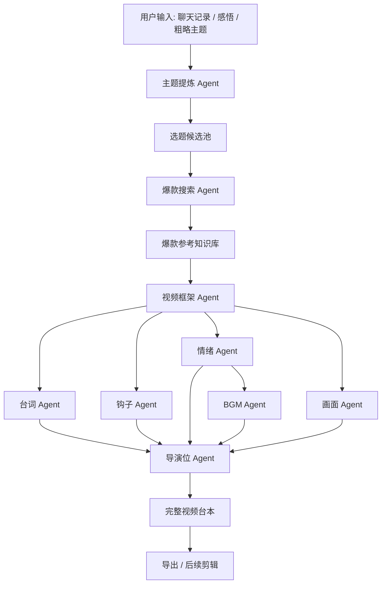
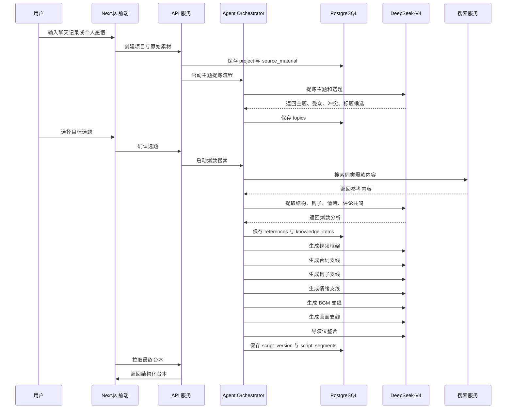
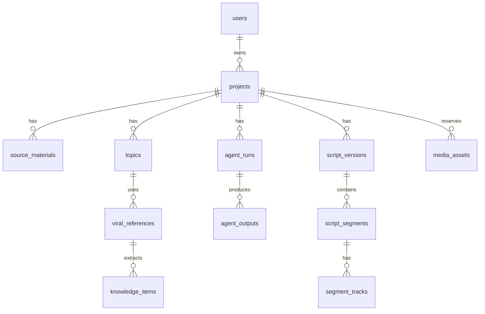
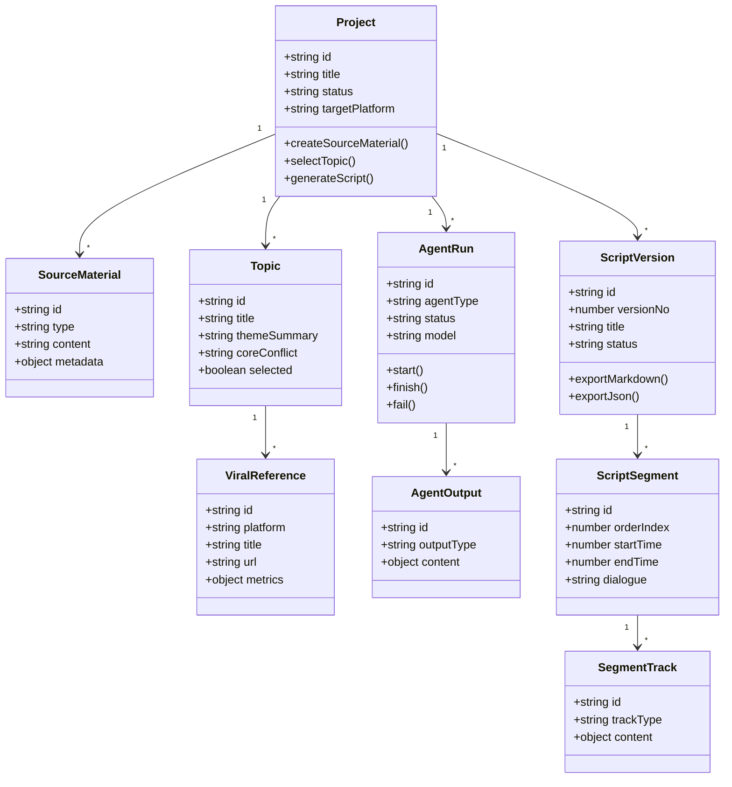

# AI 自媒体视频台本生成系统设计文档

## 1. 项目概述

本系统是一个基于 Next.js 全栈架构的 BS 系统，面向自媒体创作者，将粗略聊天记录、个人感悟、灵感片段或主题想法，转化为可发布短视频所需的完整视频台本。

系统的核心目标不是简单生成一段口播文案，而是完成从“想法”到“导演级台本”的结构化创作流程，包括选题提炼、爆款参考知识库构建、视频框架生成、台词设计、钩子管理、情绪曲线、BGM 推荐、画面支线、AI 生图/生视频提示词以及导演位整合。

## 2. 核心目标

### 2.1 业务目标

- 从聊天记录或个人感悟中提炼可视频化主题。
- 搜集同类爆款视频，沉淀为当前选题的临时知识库。
- 生成完整视频框架，包括开头、承接、冲突、展开、反转、结尾。
- 将钩子自然融入台词，而不是独立堆砌。
- 梳理视频推进过程中的情绪起伏。
- 根据情绪变化推荐合适的 BGM 和音效。
- 生成画面支线，用 AI 图片或 AI 视频承接口播中的抽象概念。
- 通过导演位智能体整合多智能体输出，形成最终可剪辑台本。

### 2.2 技术目标

- 使用 Next.js 构建前后端一体化应用。
- 使用 PostgreSQL 存储项目、素材、智能体运行结果和台本版本。
- 使用 DeepSeek-V4 作为主要大模型。
- 使用任务队列处理搜索、生成、复核等长任务。
- 将不同创作维度拆分为独立智能体，便于调试、复用和版本管理。
- 为后续剪辑、素材生成、发布平台对接预留扩展位。

## 3. 系统边界

### 3.1 MVP 范围

MVP 阶段聚焦于“完整剧本生成”：

- 输入聊天记录或感悟。
- 提炼主题和候选选题。
- 搜集爆款视频参考。
- 生成视频主线框架。
- 生成台词、情绪、画面、BGM、钩子支线。
- 导演位整合输出完整台本。
- 支持导出 Markdown、JSON、CSV。

### 3.2 暂不实现

- 视频自动剪辑。
- 自动发布到抖音、视频号、小红书、B 站等平台。
- 完整版权音乐库。
- 精确平台播放量数据抓取。
- 多人协作审批流。

这些能力在数据结构中预留，但不作为第一阶段核心功能。

## 4. 总体架构



### 4.1 前端层

- Next.js App Router。
- React Server Components + Client Components。
- shadcn/ui 或 Radix UI 作为基础组件。
- Tailwind CSS 实现界面样式。
- Zustand 管理前端工作流状态。

主要页面：

- 项目列表页。
- 项目工作台。
- 原始素材输入页。
- 选题确认页。
- 爆款参考页。
- 台本编辑页。
- 多智能体运行记录页。
- 导出页。

### 4.2 服务层

- Next.js Route Handlers 提供 API。
- Server Actions 处理简单表单提交。
- Agent Orchestrator 负责任务编排。
- Queue Worker 处理长时间 AI 任务。
- Search Adapter 负责外部搜索源接入。
- LLM Adapter 负责 DeepSeek-V4 调用。

### 4.3 数据层

- PostgreSQL 作为主数据库。
- Prisma 作为 ORM。
- Redis 用于任务队列、缓存和运行状态。
- 对象存储用于后续图片、视频、音频素材。

## 5. 数据流设计

### 5.1 主数据流



### 5.2 素材数据流

原始输入不是直接进入最终台本，而是经过多层结构化：

1. `source_materials` 保存原始聊天记录、感悟或笔记。
2. `topics` 保存主题和选题。
3. `viral_references` 保存爆款视频参考。
4. `knowledge_items` 保存从爆款内容中提取的结构化知识。
5. `script_outlines` 保存视频框架。
6. `agent_outputs` 保存每个智能体的中间结果。
7. `script_versions` 保存最终台本版本。
8. `script_segments` 保存按时间轴拆分的分镜段落。

## 6. 智能体设计

### 6.1 主题提炼 Agent

职责：

- 从聊天记录中提炼主题。
- 提取用户真实关心的问题。
- 将抽象表达转化为可传播选题。
- 生成多个候选选题。

输入：

- 原始聊天记录。
- 用户补充说明。
- 目标平台。
- 视频类型偏好。

输出：

- 主题摘要。
- 候选选题。
- 目标受众。
- 核心冲突。
- 情绪基调。

### 6.2 爆款搜索 Agent

职责：

- 搜索类似选题的爆款视频、标题、评论和文案。
- 过滤无关内容。
- 提炼可借鉴结构。
- 构建当前项目知识库。

输出维度：

- 爆款标题模式。
- 开头钩子模式。
- 叙事结构。
- 情绪推进。
- 评论区共鸣点。
- 画面风格。
- 节奏特征。

### 6.3 视频框架 Agent

职责：

- 将选题拆解成完整短视频结构。
- 明确每一段的目标。
- 规划节奏、转折、信息密度和结尾动作。

输出：

- 视频总时长。
- 分段结构。
- 每段意图。
- 每段重点信息。
- 预计时间范围。

### 6.4 台词 Agent

职责：

- 生成口播台词。
- 将主题转化为自然表达。
- 控制句长、停顿和口语化程度。
- 与钩子 Agent 协作，将钩子自然嵌入台词。

输出：

- 每段台词。
- 语气标注。
- 停顿建议。
- 强调词。
- 字幕强调建议。

### 6.5 钩子 Agent

职责：

- 设计开头钩子。
- 设计中段防流失钩子。
- 设计结尾互动钩子。
- 检查钩子是否和主题一致。

钩子类型：

- 反常识钩子。
- 情绪共鸣钩子。
- 悬念钩子。
- 身份代入钩子。
- 损失厌恶钩子。
- 冲突升级钩子。

### 6.6 情绪 Agent

职责：

- 设计视频情绪曲线。
- 精确标注每一段情绪状态。
- 确定情绪从低到高、从紧到松、从压抑到释放的变化。
- 避免整条视频情绪单调。

情绪字段：

- 主情绪。
- 辅助情绪。
- 情绪强度，范围 1-10。
- 情绪变化方向：上升、下降、停顿、反转。
- 触发原因。
- 观众预期反应。

### 6.7 BGM Agent

职责：

- 根据情绪曲线推荐 BGM。
- 标注每段音乐的进入、退出和强弱。
- 推荐音效点位。

输出：

- BGM 情绪标签。
- 节奏 BPM 建议。
- 乐器倾向。
- 音量变化。
- 音效建议。
- 可搜索关键词。

### 6.8 画面 Agent

职责：

- 将抽象口播转化为视觉画面。
- 为每一段生成画面说明。
- 生成 AI 图片提示词或 AI 视频提示词。
- 提供镜头语言和剪辑建议。

输出：

- 画面描述。
- 镜头类型。
- 景别。
- 运动方式。
- AI 生图提示词。
- AI 视频提示词。
- 字幕排版建议。

### 6.9 导演位 Agent

职责：

- 整合所有支线。
- 检查台词、画面、情绪、BGM、钩子是否一致。
- 修复节奏不顺、钩子突兀、画面无法执行等问题。
- 输出最终台本。

导演位检查项：

- 主题是否清晰。
- 开头 3 秒是否有效。
- 中段是否存在流失风险。
- 情绪曲线是否有变化。
- 画面是否能承接口播。
- BGM 是否和情绪匹配。
- 结尾是否有记忆点。
- 是否适合目标平台。

## 7. 数据库设计

### 7.1 ER 图



### 7.2 主要表结构

#### users

| 字段 | 类型 | 说明 |
|---|---|---|
| id | uuid | 用户 ID |
| name | varchar | 用户名 |
| email | varchar | 邮箱 |
| created_at | timestamptz | 创建时间 |
| updated_at | timestamptz | 更新时间 |

#### projects

| 字段 | 类型 | 说明 |
|---|---|---|
| id | uuid | 项目 ID |
| user_id | uuid | 用户 ID |
| title | varchar | 项目标题 |
| status | varchar | draft / generating / completed / archived |
| target_platform | varchar | douyin / xiaohongshu / bilibili / video_account |
| video_type | varchar | oral / story / knowledge / opinion / mixed |
| duration_seconds | int | 目标时长 |
| created_at | timestamptz | 创建时间 |
| updated_at | timestamptz | 更新时间 |

#### source_materials

| 字段 | 类型 | 说明 |
|---|---|---|
| id | uuid | 素材 ID |
| project_id | uuid | 项目 ID |
| type | varchar | chat_log / reflection / note / draft |
| content | text | 原始内容 |
| metadata | jsonb | 来源、平台、标签等 |
| created_at | timestamptz | 创建时间 |

#### topics

| 字段 | 类型 | 说明 |
|---|---|---|
| id | uuid | 选题 ID |
| project_id | uuid | 项目 ID |
| title | varchar | 选题标题 |
| theme_summary | text | 主题摘要 |
| target_audience | text | 目标受众 |
| core_conflict | text | 核心冲突 |
| emotional_tone | varchar | 情绪基调 |
| score | numeric | 推荐分 |
| selected | boolean | 是否选中 |
| created_at | timestamptz | 创建时间 |

#### viral_references

| 字段 | 类型 | 说明 |
|---|---|---|
| id | uuid | 参考 ID |
| topic_id | uuid | 选题 ID |
| platform | varchar | 平台 |
| title | varchar | 标题 |
| url | text | 链接 |
| author | varchar | 作者 |
| metrics | jsonb | 播放量、点赞、评论等 |
| transcript | text | 文案或字幕 |
| raw_data | jsonb | 原始搜索数据 |
| created_at | timestamptz | 创建时间 |

#### knowledge_items

| 字段 | 类型 | 说明 |
|---|---|---|
| id | uuid | 知识项 ID |
| reference_id | uuid | 参考 ID |
| item_type | varchar | hook / structure / emotion / visual / comment_insight |
| content | text | 提炼内容 |
| tags | text[] | 标签 |
| confidence | numeric | 置信度 |
| created_at | timestamptz | 创建时间 |

#### agent_runs

| 字段 | 类型 | 说明 |
|---|---|---|
| id | uuid | 运行 ID |
| project_id | uuid | 项目 ID |
| agent_type | varchar | topic / search / outline / dialogue / hook / emotion / bgm / visual / director |
| status | varchar | pending / running / success / failed |
| model | varchar | deepseek-v4 |
| input_snapshot | jsonb | 输入快照 |
| error_message | text | 错误信息 |
| started_at | timestamptz | 开始时间 |
| finished_at | timestamptz | 结束时间 |

#### agent_outputs

| 字段 | 类型 | 说明 |
|---|---|---|
| id | uuid | 输出 ID |
| agent_run_id | uuid | 运行 ID |
| output_type | varchar | topic_list / outline / dialogue / hook_track / emotion_track / bgm_track / visual_track / final_script |
| content | jsonb | 结构化输出 |
| created_at | timestamptz | 创建时间 |

#### script_versions

| 字段 | 类型 | 说明 |
|---|---|---|
| id | uuid | 台本版本 ID |
| project_id | uuid | 项目 ID |
| version_no | int | 版本号 |
| title | varchar | 台本标题 |
| summary | text | 台本摘要 |
| total_duration_seconds | int | 总时长 |
| status | varchar | draft / approved / exported |
| created_by_agent_run_id | uuid | 导演位运行 ID |
| created_at | timestamptz | 创建时间 |

#### script_segments

| 字段 | 类型 | 说明 |
|---|---|---|
| id | uuid | 段落 ID |
| script_version_id | uuid | 台本版本 ID |
| order_index | int | 顺序 |
| start_time | numeric | 开始秒数 |
| end_time | numeric | 结束秒数 |
| segment_goal | text | 段落目标 |
| dialogue | text | 台词 |
| subtitle_text | text | 字幕 |
| director_note | text | 导演备注 |

#### segment_tracks

| 字段 | 类型 | 说明 |
|---|---|---|
| id | uuid | 支线 ID |
| segment_id | uuid | 段落 ID |
| track_type | varchar | hook / emotion / bgm / visual / edit |
| content | jsonb | 支线内容 |
| created_at | timestamptz | 创建时间 |

#### media_assets

| 字段 | 类型 | 说明 |
|---|---|---|
| id | uuid | 素材 ID |
| project_id | uuid | 项目 ID |
| segment_id | uuid | 可为空 |
| asset_type | varchar | image / video / audio / bgm / sfx |
| generation_prompt | text | 生成提示词 |
| storage_url | text | 文件地址 |
| metadata | jsonb | 尺寸、时长、版权等 |
| status | varchar | planned / generated / selected / rejected |
| created_at | timestamptz | 创建时间 |

## 8. 类图设计



## 9. API 设计

### 9.1 项目接口

#### 创建项目

`POST /api/projects`

请求：

```json
{
  "title": "关于拖延症的短视频",
  "targetPlatform": "douyin",
  "videoType": "oral",
  "durationSeconds": 60
}
```

响应：

```json
{
  "id": "project_uuid",
  "title": "关于拖延症的短视频",
  "status": "draft"
}
```

#### 获取项目详情

`GET /api/projects/:projectId`

### 9.2 原始素材接口

#### 添加原始素材

`POST /api/projects/:projectId/source-materials`

请求：

```json
{
  "type": "chat_log",
  "content": "这里是用户和 AI 的聊天记录...",
  "metadata": {
    "source": "manual_input"
  }
}
```

### 9.3 选题接口

#### 生成候选选题

`POST /api/projects/:projectId/topics/generate`

响应：

```json
{
  "runId": "agent_run_uuid",
  "status": "running"
}
```

#### 选择选题

`POST /api/projects/:projectId/topics/:topicId/select`

### 9.4 爆款参考接口

#### 搜索爆款参考

`POST /api/topics/:topicId/references/search`

请求：

```json
{
  "platforms": ["douyin", "xiaohongshu", "bilibili"],
  "limit": 20
}
```

### 9.5 台本接口

#### 生成完整台本

`POST /api/projects/:projectId/scripts/generate`

请求：

```json
{
  "topicId": "topic_uuid",
  "durationSeconds": 60,
  "style": "sharp_emotional_oral"
}
```

响应：

```json
{
  "runId": "agent_run_uuid",
  "status": "running"
}
```

#### 获取台本版本

`GET /api/projects/:projectId/scripts/:scriptVersionId`

#### 更新台本段落

`PATCH /api/script-segments/:segmentId`

请求：

```json
{
  "dialogue": "新的台词内容",
  "directorNote": "加强这里的停顿"
}
```

#### 导出台本

`GET /api/scripts/:scriptVersionId/export?format=markdown`

支持格式：

- `markdown`
- `json`
- `csv`

### 9.6 智能体运行接口

#### 获取运行状态

`GET /api/agent-runs/:runId`

响应：

```json
{
  "id": "agent_run_uuid",
  "agentType": "director",
  "status": "success",
  "startedAt": "2026-05-13T10:00:00Z",
  "finishedAt": "2026-05-13T10:01:30Z"
}
```

## 10. Agent 编排伪代码

### 10.1 总编排流程

```ts
async function generateFullVideoScript(projectId: string, topicId: string) {
  const project = await projectRepo.findById(projectId);
  const topic = await topicRepo.findById(topicId);
  const sources = await sourceRepo.findByProjectId(projectId);
  const references = await referenceRepo.findByTopicId(topicId);
  const knowledgeItems = await knowledgeRepo.findByTopicId(topicId);

  const outline = await runAgent("outline", {
    project,
    topic,
    sources,
    references,
    knowledgeItems,
  });

  const [dialogueTrack, hookTrack, emotionTrack, visualTrack] =
    await Promise.all([
      runAgent("dialogue", { project, topic, outline, knowledgeItems }),
      runAgent("hook", { project, topic, outline, knowledgeItems }),
      runAgent("emotion", { project, topic, outline, knowledgeItems }),
      runAgent("visual", { project, topic, outline, knowledgeItems }),
    ]);

  const bgmTrack = await runAgent("bgm", {
    project,
    topic,
    outline,
    emotionTrack,
  });

  const finalScript = await runAgent("director", {
    project,
    topic,
    outline,
    dialogueTrack,
    hookTrack,
    emotionTrack,
    bgmTrack,
    visualTrack,
  });

  return await scriptRepo.createVersionFromDirectorOutput(projectId, finalScript);
}
```

### 10.2 智能体运行封装

```ts
async function runAgent<TInput, TOutput>(
  agentType: AgentType,
  input: TInput
): Promise<TOutput> {
  const run = await agentRunRepo.create({
    agentType,
    status: "running",
    model: "deepseek-v4",
    inputSnapshot: input,
  });

  try {
    const prompt = buildPrompt(agentType, input);
    const schema = getOutputSchema(agentType);

    const output = await llmClient.generateStructured({
      model: "deepseek-v4",
      prompt,
      schema,
      temperature: getAgentTemperature(agentType),
    });

    await agentOutputRepo.create({
      agentRunId: run.id,
      outputType: getOutputType(agentType),
      content: output,
    });

    await agentRunRepo.markSuccess(run.id);
    return output;
  } catch (error) {
    await agentRunRepo.markFailed(run.id, String(error));
    throw error;
  }
}
```

### 10.3 导演位整合伪代码

```ts
async function directFinalScript(input: DirectorInput): Promise<FinalScript> {
  const segments = input.outline.segments.map((segment) => {
    const dialogue = findTrackItem(input.dialogueTrack, segment.id);
    const hook = findTrackItem(input.hookTrack, segment.id);
    const emotion = findTrackItem(input.emotionTrack, segment.id);
    const bgm = findTrackItem(input.bgmTrack, segment.id);
    const visual = findTrackItem(input.visualTrack, segment.id);

    return {
      orderIndex: segment.orderIndex,
      startTime: segment.startTime,
      endTime: segment.endTime,
      segmentGoal: segment.goal,
      dialogue: mergeHookIntoDialogue(dialogue.text, hook),
      subtitleText: buildSubtitle(dialogue.text, hook),
      tracks: {
        hook,
        emotion,
        bgm,
        visual,
        edit: buildEditSuggestion(segment, hook, emotion, visual),
      },
      directorNote: buildDirectorNote(segment, hook, emotion, bgm, visual),
    };
  });

  return {
    title: input.topic.title,
    summary: input.outline.summary,
    totalDurationSeconds: input.project.durationSeconds,
    segments,
    qualityChecklist: validateScriptQuality(segments),
  };
}
```

## 11. LLM Prompt 设计要点

### 11.1 通用约束

所有智能体都应使用结构化输出，避免只返回自然语言。

通用要求：

- 输出必须符合 JSON Schema。
- 不直接复制爆款参考内容。
- 只借鉴结构、节奏和表达策略。
- 标注不确定性。
- 每个结论尽量绑定来源或依据。
- 保持适合目标平台的表达风格。

### 11.2 台词 Agent Prompt 核心

重点约束：

- 台词必须口语化。
- 每句话尽量短。
- 保留停顿。
- 避免论文式表达。
- 钩子位置要自然。
- 金句要服务主题，不堆砌。

### 11.3 情绪 Agent Prompt 核心

重点约束：

- 情绪必须随视频推进变化。
- 每段需要明确主情绪和辅助情绪。
- 情绪强度需要量化。
- 标注情绪变化方向。
- 给出观众此刻可能产生的心理反应。

### 11.4 画面 Agent Prompt 核心

重点约束：

- 画面必须承接口播，而不是装饰。
- 抽象观点需要转化成可视化隐喻或具体场景。
- 每段提供 AI 图片提示词和 AI 视频提示词。
- 提示词需要包含主体、场景、光线、构图、风格和运动。

## 12. DeepSeek-V4 接入设计

### 12.1 LLM Client 抽象

```ts
interface LLMClient {
  generateText(input: GenerateTextInput): Promise<string>;
  generateStructured<T>(input: GenerateStructuredInput<T>): Promise<T>;
}

interface GenerateStructuredInput<T> {
  model: string;
  prompt: string;
  schema: JsonSchema;
  temperature?: number;
  maxTokens?: number;
}
```

### 12.2 模型使用策略

| 场景 | temperature | 说明 |
|---|---:|---|
| 主题提炼 | 0.4 | 兼顾准确和发散 |
| 爆款分析 | 0.2 | 更偏分析和归纳 |
| 视频框架 | 0.5 | 保持结构创造力 |
| 台词生成 | 0.7 | 需要表达活性 |
| 钩子生成 | 0.8 | 需要强创意 |
| 情绪分析 | 0.4 | 需要稳定判断 |
| BGM 推荐 | 0.4 | 基于情绪匹配 |
| 画面生成 | 0.7 | 需要视觉创意 |
| 导演整合 | 0.3 | 偏一致性和校验 |

## 13. 前端页面设计

### 13.1 项目工作台

左侧：

- 项目步骤导航。
- 当前状态。
- 智能体运行进度。

中间：

- 当前步骤主工作区。
- 选题、参考、台本表格等核心内容。

右侧：

- 项目上下文。
- AI 解释。
- 版本记录。
- 导出按钮。

### 13.2 台本编辑器

台本编辑器以时间轴表格为核心：

| 时间 | 台词 | 画面 | 情绪 | BGM | 钩子 | 导演备注 |
|---|---|---|---|---|---|---|
| 0-3s | 开头台词 | 快切画面 | 好奇 8/10 | 悬疑低频 | 开头钩子 | 字幕放大 |

支持能力：

- 单段重写。
- 单支线重写。
- 锁定某段内容后重新生成其他支线。
- 查看该段由哪些 Agent 输出组成。
- 导出 Markdown / JSON / CSV。

## 14. 后续剪辑预留

虽然 MVP 不做自动剪辑，但数据结构应提前保留剪辑字段：

- 镜头时长。
- 转场类型。
- 字幕样式。
- 字幕强调词。
- 音效点位。
- BGM 入点和出点。
- 素材文件地址。
- AI 生成素材提示词。

后续可扩展为：

- 接入 Remotion 生成视频。
- 接入 FFmpeg 自动合成。
- 接入 CapCut/Jianying 草稿格式。
- 接入云端视频渲染队列。

## 15. 权限与安全

- 用户只能访问自己的项目。
- 原始聊天记录可能包含隐私，需要加密或脱敏。
- 爆款参考只保存必要分析结果，避免直接搬运完整作品。
- LLM 请求日志需要区分调试模式和生产模式。
- 导出内容应保留版本号，便于追踪。

## 16. MVP 开发里程碑

### 阶段一：项目与输入

- 项目 CRUD。
- 原始素材输入。
- 主题提炼。
- 候选选题生成。

### 阶段二：爆款参考

- 搜索接口抽象。
- 参考内容保存。
- 知识项提炼。
- 爆款结构分析。

### 阶段三：台本生成

- 视频框架生成。
- 台词支线生成。
- 钩子支线生成。
- 情绪支线生成。
- BGM 支线生成。
- 画面支线生成。
- 导演位整合。

### 阶段四：编辑与导出

- 台本时间轴编辑器。
- 单段重写。
- 版本管理。
- Markdown / JSON / CSV 导出。

## 17. 风险与对策

| 风险 | 说明 | 对策 |
|---|---|---|
| 爆款数据难获取 | 平台限制较多 | 先支持手动录入和通用搜索 |
| 生成结果不稳定 | 多 Agent 可能风格不一致 | 导演位统一复核 |
| 台词像 AI 味 | 过于抽象或书面 | 台词 Agent 增加口语化检查 |
| 画面无法落地 | 提示词太虚 | 画面 Agent 强制输出具体主体和场景 |
| BGM 版权问题 | 不能直接推荐侵权音乐 | 只推荐情绪标签和搜索关键词 |
| 长任务体验差 | 多 Agent 生成耗时 | 使用队列和前端进度流 |

## 18. 最终输出格式示例

```json
{
  "title": "你不是拖延, 你是在逃避一个太模糊的目标",
  "durationSeconds": 60,
  "segments": [
    {
      "startTime": 0,
      "endTime": 3,
      "dialogue": "你以为你是在拖延, 其实你是在害怕开始。",
      "subtitleText": "你不是拖延, 是害怕开始",
      "tracks": {
        "hook": {
          "type": "反常识钩子",
          "intent": "打破用户对拖延的常见理解"
        },
        "emotion": {
          "primary": "刺痛",
          "secondary": "被看见",
          "intensity": 8,
          "direction": "上升"
        },
        "bgm": {
          "mood": "低频悬疑",
          "bpm": "70-85",
          "keywords": ["ambient tension", "soft pulse"]
        },
        "visual": {
          "description": "一个人坐在电脑前, 鼠标停在空白文档上很久",
          "imagePrompt": "a young creator sitting in front of a blank document on a laptop, dim room, close-up, realistic cinematic lighting",
          "videoPrompt": "slow push-in shot of a laptop with blank document, creator's hand hovering over keyboard, quiet tense atmosphere"
        }
      },
      "directorNote": "开头字幕直接压上, 0.5 秒内出现关键词。"
    }
  ]
}
```

## 19. 结论

本系统的核心价值在于将自媒体视频创作从单点文案生成升级为结构化创作流程。通过主题提炼、爆款知识库、多支线智能体和导演位整合，系统可以稳定产出更接近真实短视频生产流程的完整台本。

第一阶段应优先打通“输入素材 -> 选题 -> 爆款参考 -> 多支线台本 -> 导出”的闭环。剪辑、素材生成和发布平台对接可以在该闭环稳定后逐步扩展。
